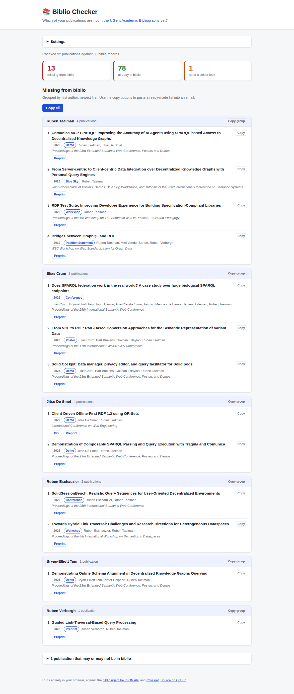

# Biblio Checker

[](https://github.com/rubensworks/biblio-checker/actions?query=workflow%3ACI)

Lists which publications from a BibTeX bibliography are **not** in the
[UGent Academic Bibliography](https://biblio.ugent.be/) yet, grouped by first author,
so you know exactly what still needs to be registered and who to chase for it.

Everything runs in the browser: no backend, no API key, nothing is stored anywhere but your own browser.



<sub>OpenAlex was out of daily quota when this screenshot was taken, hence the warning: the publication statuses
shown come from Crossref alone.</sub>

## Usage

Open the app, and it immediately checks the configured bibliography.
The defaults point at [rubensworks.net](https://www.rubensworks.net/)'s `references.bib` and at Ruben Taelman's
biblio records, but both can be changed under **Settings** and are remembered by your browser.

Results are split into four buckets:

| Bucket | Meaning |
| --- | --- |
| **Missing from biblio** | Published at a conference or journal, and no biblio record resembles it. These are the ones to add, and they are the only ones in the main list. |
| **Already in biblio** | Matched on DOI, on an identical title, or on a title that is close enough. |
| **Preprint only** | No publisher version could be found, so it is not ready for biblio yet. Collapsed at the bottom of the page. |
| **Need a closer look** | Resembles an existing record, but not closely enough to decide automatically. Collapsed at the bottom of the page. |

Every missing publication shows its **DOI**, **preprint link** and **published link** where these are known.

### Copying into an email

Every copy button puts both a rich text and a plain text flavour on the clipboard, so pasting into a mail client
keeps the links clickable, while plain text editors get a readable fallback.

* **Copy all** — the full list, with a heading and all groups.
* **Copy group** — one author's publications, for a mail to that specific co-author.
* **Copy** — a single publication.

## How the comparison works

1. The BibTeX file is downloaded and parsed in the browser.
2. All biblio records of the configured author are fetched from the
   [biblio.ugent.be JSON API](https://biblio.ugent.be/publication?q=&format=json)
   (the regular search interface with `format=json`, which sends `Access-Control-Allow-Origin: *`).
3. Each publication is matched against those records:
   * a shared DOI or an identical normalized title is conclusive;
   * otherwise a similarity score combining character bigrams and word overlap decides,
     dampened when the publication years are more than one year apart.
4. Optionally, two enrichment steps run over whatever is still unmatched:
   * **Search biblio by title as well** searches the whole bibliography for the title, which finds records that
     already exist but are not linked to you — those only need to be claimed, not added.
   * **Check where publications appeared** finds out which ones actually reached a publisher, and fills in DOIs
     along the way. See below.

## Deciding what counts as published

A publication only belongs in biblio once it exists at a publisher, so everything that is still just a preprint
is kept out of the main list and collapsed at the bottom of the page instead.

Only publications that are really missing from biblio are looked up. Whether something that is already
registered reached a publisher makes no difference to what still has to be added, so publications that matched a
biblio record, that only resemble one closely enough to need review, or that the title search found under
another author, are all skipped rather than spending somebody else's rate limit on them.

For the ones that remain, the bibliography is trusted first: a DOI that was not registered by arXiv, or a URL
pointing at a publisher rather than at a self-archived copy, settles the question without a request. Otherwise
two databases are asked in order, and the first confident answer wins:

1. [**OpenAlex**](https://docs.openalex.org/), which also indexes proceedings that never get a DOI. A work counts
   as published unless it is typed as a `preprint` or every one of its locations is a `repository`, which is how
   OpenAlex types arXiv and institutional archives.
2. [**Crossref**](https://api.crossref.org/), as a second opinion, and only when OpenAlex had no answer. Its
   `posted-content` type means a preprint; `journal-article`, `proceedings-article`, `book-chapter` and friends
   mean published.

Both always answer with their best guesses, so results are only accepted when the returned title closely matches
the queried one. Both also throttle bursts, so a `429` is retried with a short backoff rather than treated as a
failure — unless the `Retry-After` says the daily quota is gone, in which case the source is given up on.

When **no** source could be reached, the publication keeps an unknown status and stays in the main list with a
warning, rather than being hidden on a guess. The status line names the databases that were unreachable.

### Finding your biblio query

The **Biblio query** setting is a raw [biblio.ugent.be](https://biblio.ugent.be/publication) search query.
The reliable one is `ugent_id:<your UGent id>`. To find your id, search for one of your publications and look at
the JSON of the response:

```bash
curl 'https://biblio.ugent.be/publication?q=%22Your+Name%22&format=json&limit=1' | jq '.hits[0].author'
```

## Development

```bash
npm install
npm run dev     # Development server
npm run build   # Typecheck and bundle into dist/
npm run lint    # ESLint, using @rubensworks/eslint-config
npm test        # Jest
```

## Deployment

`npm run build` writes a self-contained bundle to `dist/`, using a relative base so it works from any
subdirectory. See [`docs/deployment.md`](docs/deployment.md) for the GitHub Actions workflows that build it
and publish it to GitHub Pages on every push to the default branch.

## License

This code is copyrighted by [Ruben Taelman](https://www.rubensworks.net/)
and released under the [MIT license](http://opensource.org/licenses/MIT).
